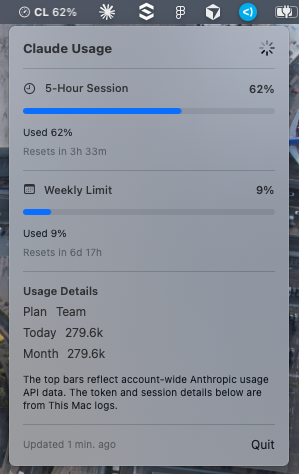

# agent-bar-custom

Customized fork of [agent-bar](https://github.com/chenjingdev/agent-bar) — a macOS menu bar app for watching Claude Code and Codex usage at a glance.

It shows a compact gauge icon, provider label, and 5-hour usage percentage in the menu bar, and opens a detailed popover when clicked. The popover shows account-wide 5-hour and weekly usage. The `This Mac` details come from local logs on the current machine.

## Changes from Original

- Native macOS menu bar appearance via SwiftUI `MenuBarExtra(.window)` (no popover arrow, attaches directly under the menu bar item)
- Menu bar label rendered as a template image so it auto-tints with light/dark menu bar appearance
- Dynamic gauge icon (`gauge.with.dots.needle.X`) reflects 5-hour usage in five steps
- Popover uses native macOS system colors and semantic typography (`.headline`/`.subheadline`/`.callout`/`.caption`)
- Window cards distinguished by SF Symbol icons (clock for 5-hour, calendar for weekly) instead of color
- Removed in-popover Customize section (color palette and bar width slider)
- Removed Recent Sessions section from popover
- Removed Settings window (refresh interval fixed at 120s)
- Swift tools version lowered to 5.10 for broader Xcode compatibility

## Screenshots



## Overview

- Shows separate menu bar items for Claude and Codex
- Shows account-wide 5-hour and weekly usage percentages
- Shows reset times, plan name, and local `This Mac` summaries
- Hides providers that are not available on the current Mac
- Keeps the last known good usage when an upstream usage endpoint is temporarily unavailable

## Requirements

- macOS 14 or later
- Swift 5.10 or later, or Xcode Command Line Tools with `swift` available
- Claude support: Claude Code installed, and logged in via macOS Keychain or `~/.claude/.credentials.json`
- Codex support: `codex` in `~/.bun/bin/codex`, `/opt/homebrew/bin/codex`, or `/usr/local/bin/codex`
- Codex support: `node` in `~/.bun/bin/node`, `/opt/homebrew/bin/node`, `/usr/local/bin/node`, or `/usr/bin/node`

If you install or log in to Claude Code or Codex after agent-bar is already running, restart the app so provider detection runs again.

## Run

```bash
git clone https://github.com/jsiksn/agent-bar-custom.git
cd agent-bar-custom
swift run agent-bar
```

- This repository is intended to run from source with `swift run`
- If `swift` is missing, install Xcode Command Line Tools first: `xcode-select --install`
- The app appears in the macOS menu bar, not the Dock
- On first launch you may briefly see `0%` placeholders while the first refresh completes
- Available providers show up only when their local credentials or binaries are detectable

## Data Sources

- Claude account-wide usage: macOS Keychain or `~/.claude/.credentials.json`, then `https://api.anthropic.com/api/oauth/usage`
- Codex account-wide usage: `codex app-server`, then `account/rateLimits/read`
- Claude `This Mac` details: `~/.claude/projects/**/*.jsonl`
- Codex `This Mac` details: `~/.codex/logs_1.sqlite` and `~/.codex/state_5.sqlite`

## Notes

- Running from source is the default workflow; distributing an unsigned macOS app is more fragile on other Macs
- Top bars are account-wide
- `This Mac` sections are local-only and do not include activity from other machines
- Values refresh periodically and may be slightly stale by design
- agent-bar keeps the last known good value during temporary upstream failures or rate limits
- There is no backend service, telemetry, or browser-cookie setup

Cache files:

- `~/.agentbar/claude-usage-cache.json`
- `~/.agentbar/codex-rate-limits-cache.json`

## Troubleshooting

- Provider missing: check the required credentials or binaries above, then restart agent-bar
- Value looks stale: open the popover and check the update timestamp; upstream may be temporarily unavailable or rate-limited
- Top percentage does not match `This Mac`: expected when you use the same account on multiple Macs, or when local logs are incomplete

## Credits

Original project by [chenjingdev](https://github.com/chenjingdev/agent-bar)
