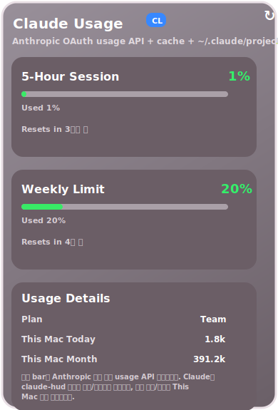
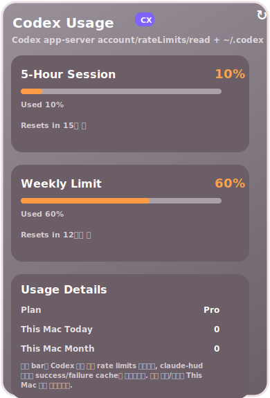

# agent-bar

agent-bar is a macOS menu bar app for watching Claude Code and Codex usage at a glance.

It shows compact 5-hour usage bars in the menu bar and opens a detailed popover when clicked. The top bars are account-wide. The lower `This Mac` details come from local logs on the current machine.

## Screenshots

<table>
  <tr>
    <td width="50%"></td>
    <td width="50%"></td>
  </tr>
  <tr>
    <td align="center"><strong>Claude</strong></td>
    <td align="center"><strong>Codex</strong></td>
  </tr>
</table>

## Overview

- Shows separate menu bar items for Claude and Codex
- Shows account-wide 5-hour and weekly usage percentages
- Shows reset times, plan name, and local `This Mac` summaries
- Hides providers that are not available on the current Mac
- Keeps the last known good usage when an upstream usage endpoint is temporarily unavailable

## Requirements

- macOS 14 or later
- Swift 6.2 or later
- Claude support: Claude Code installed, and logged in via macOS Keychain or `~/.claude/.credentials.json`
- Codex support: `codex` in `~/.bun/bin/codex`, `/opt/homebrew/bin/codex`, or `/usr/local/bin/codex`
- Codex support: `node` in `~/.bun/bin/node`, `/opt/homebrew/bin/node`, `/usr/local/bin/node`, or `/usr/bin/node`

If you install or log in to Claude Code or Codex after agent-bar is already running, restart the app so provider detection runs again.

## Run

```bash
git clone https://github.com/chenjingdev/agent-bar.git
cd agent-bar
swift run agent-bar
```

- The app appears in the macOS menu bar, not the Dock
- On first launch you may briefly see `0%` placeholders while the first refresh completes
- Available providers show up only when their local credentials or binaries are detectable

## Data Sources

- Claude account-wide usage: macOS Keychain or `~/.claude/.credentials.json`, then `https://api.anthropic.com/api/oauth/usage`
- Codex account-wide usage: `codex app-server`, then `account/rateLimits/read`
- Claude `This Mac` details: `~/.claude/projects/**/*.jsonl`
- Codex `This Mac` details: `~/.codex/logs_1.sqlite` and `~/.codex/state_5.sqlite`

## Notes

- Top bars are account-wide
- `This Mac` sections are local-only and do not include activity from other machines
- Values refresh periodically and may be slightly stale by design
- agent-bar keeps the last known good value during temporary upstream failures or rate limits
- There is no backend service, telemetry, or browser-cookie setup

Cache files:

- `~/.agentbar/claude-usage-cache.json`
- `~/.agentbar/codex-rate-limits-cache.json`

## Troubleshooting

- Provider missing: check the required credentials or binaries above, then restart agent-bar
- Value looks stale: open the popover and check the update timestamp; upstream may be temporarily unavailable or rate-limited
- Top percentage does not match `This Mac`: expected when you use the same account on multiple Macs, or when local logs are incomplete
